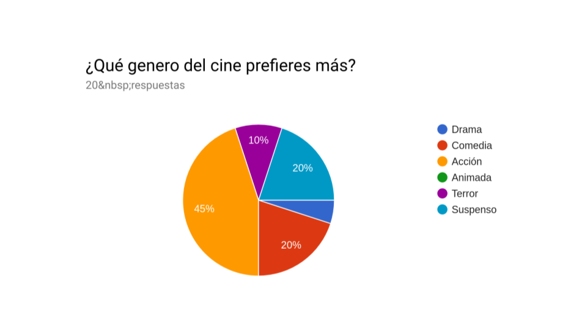
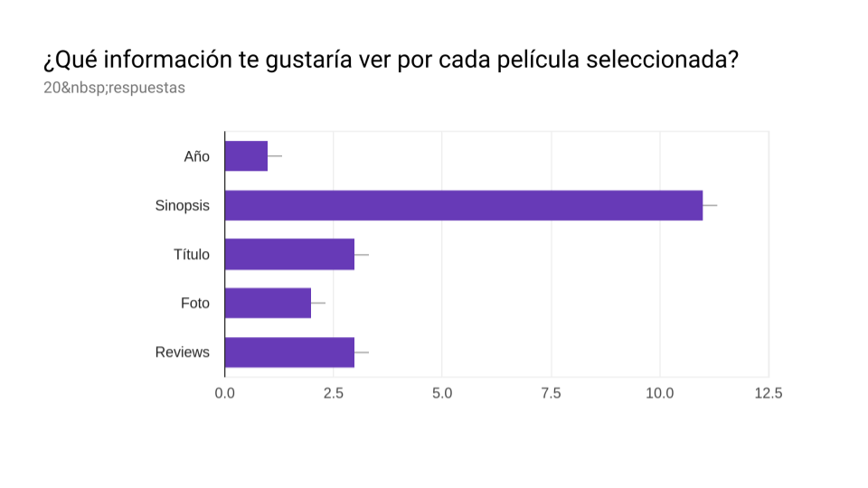
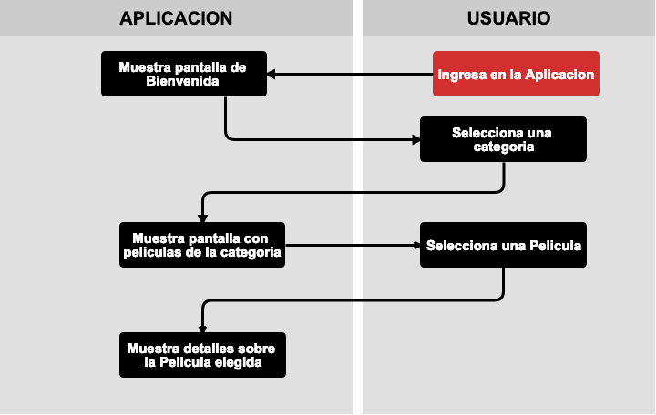
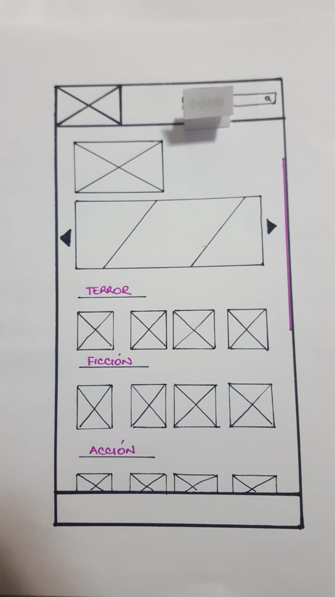
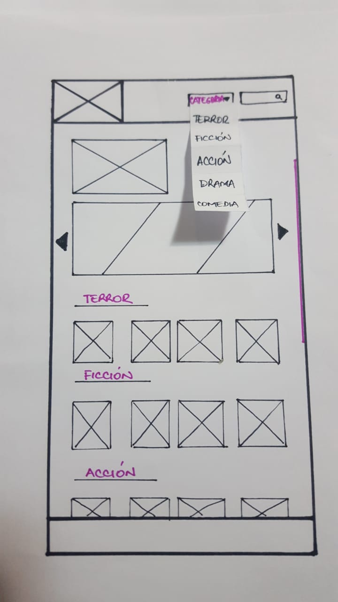

# LYKfilms

## Índice

* [Historia del cine](#historia-del-cine)
* [LYKfilms](#lykfilms)
* [Procesos del Diseño](#proceso-del-diseño)
* [Planificación del Proyecto](#planinficación-del-proyecto)
* [Historias de Usuarios](#historias-de-usuarios)
* [Encuesta aplicada](#encuesta-aplicada)
* [User persona](#user-persona)
* [Diagrama de Flujo](#diagrama-de-flujo)
* [Ideación](#cideación)
* [Prototipado de Baja Fidelidad](#prototipado-de-baja-fidelidad)
* [Prototipado de Alta Fidelidad](#prototipado-de-alta-fidelidad)
* [Testeo de Usabilidad](#testeedo-de-usabilidad)

***

## Historia del Cine

La historia del cine como espectáculo comenzó en París el 28 de diciembre de 1895.
El cine clásico engloba las convenciones visuales, sonoras, genéricas e ideológicas que emanaron durante dicho periodo. Es un cine tradicional, constituido por un sistema de convenciones que constituyen la tradición cinematográfica. Emplea siempre los mismos recursos tradicionales, sin introducir elementos rupturistas, a diferencia del cine independiente (el cual se vuelve más individual).

Pocas cosas pueden producirnos más nostalgia que los grandes clásicos del cine antiguo. Que esas películas que hemos visto decenas de veces, de las que nos sabemos los diálogos de memoria y que siempre saben arrancarnos una sonrisa o algunas lágrimas. Hasta puede que exista alguna que no hayamos descubierto todavía, así que nos hemos propuesto recopilar películas del cine clásico. En LYKfilms tienes un catálogo donded encontras por género las películas clásicas más taquilleras y no te queden sin conocer un poco más de sus historias.

## LYKfilms

Si usted realmente desea ser considerado como un auténtico amante del cine, decididamente tiene que entrar a LYKfilms en esta plataforma podrás encontrar una serie de películas que te llevaran al pasado, logrando enamorarte mása con cada historia reproducida por el cine. Cada una fue pionera e indicó el camino que seguirían los filmes del futuro, o asimiló las lecciones del pasado de forma impresionantemente innovadora.

Es por ello que a ti que te apasiona el cine hemos creado LYKfilms donde encontrarás quizas títulos de películas que aun no hayas visto.

## Proceso del Diseño 🎨

LYKfilms esta diseñada pensando en los amantes del cine, a continuación conooce un poco más de la orientacion de esta plataforma:

1. ¿Quiénes son los principales usuarios de producto?

Amantes del cine clásico, cinéfilo y para todas las personas que nunca quieren olvidar las películas del pasado.

2. ¿Cuáles son los objetivos de los usuarios de esta aplicación?

Poder identificar por género, por año, o título sus películas clasicass favoritas. 

3. ¿Que datos más relevantes se muestran en la interfaz?

Las categorias u género de las peliculas y su imagen.

4. ¿Cómo crees que el producto resuelve el problema que tiene tu usuario?

Al lograr poder seleccionar las películas clásicas y de mayor ranking para el momento nuestros usuarios se siente sastisfecho al encontrar en LYKfilms lo que tanto deseaban.

5. ¿Cuándo utilizan o utilizarían el producto?

Antes de querer ver una película y no recuerde su nombre o titulo de la misma.

## Planificación del proyecto 📑

Con trello se llevo de manera más detallada la planifición y se cumplio de acuerdo a cada historia de usuario  [Trello](https://trello.com) el cual se pueden encontrar [aquí](https://trello.com/b/wUs1B2Qp/lykfims)

### Historias de usuario 👩🏻🧔🏻

Historia de Usuario 1:
Carlos Azócar, 45 años de Edad.

Como: aficionado al cine

Quiero: ver las películas clásicas

Para: poder escoger la de mi preferencia

Criterios de Aceptación:

* La plataforma debe mostrar una serie de películas consideradas como clásicas que cumplan con la necesidad del usuario

Historia de Usuario 2:
Pedro García, 56 años de Edad.

Como: cinéfilo

Quiero: tener un buscador

Para: que mi búsqueda sea más rápida.

Criterios de Acepatación:

* la plataforma debe tener un buscador que le permita al usuario escoger fácilmente la película que desee

* el buscador debe tener un renglón que le permita al usuario ingresar el nombre de la película

Historia de Usuario 3:
Maria Eugenia Bello, 53 años Edad.

Como: fanática del cine

Quiero: ver el nombre, mejor ranking, popularidad y año en que fue estrenada la película que seleccione

Para: seguir conociendo más de las películas.

Criterios de Aceptación:

* la plataforma debe poseer una serie de películas clásicas

* Al momento del usuario seleccionar la película de su preferencia esta debe contener información relevante al usuario como el director de la misma y el año en que fue creada.

* Se recorre la data con un Bucle para mostrar los resultdos.

Historia de Usuario 4:
Carola Saez, 37 años de Edad.

Como: amante del cine

Quiero: poder leer una descripción breve de la película que elija 

Para: conocer un poco más antes de verla.

Criterios de Aceptación:

* la plataforma debe poseer una serie de películas clásicas

* Al momento del usuario seleccionar la película de su preferencia esta debe contener información relevante al usuario como la descripción de la misma.

Historia de Usuario 5:
Miroslava Rodriguez, 55 años de Edad.

Como: amante del cine

Quiero: poder encontrar las películas clásicas del genero drama y ficción

Para: poder seleccionar la que me guste.

Criterios de Aceptación:

* la plataforma debe poseer una serie de películas clásicas

* la plataforma de mostrar botones con opción de género para que el usuario pueda encontrar de manera más rápida el género de ficción.

* la plataforma de mostrar botones con opción de género para que el usuario pueda encontrar de manera más rápida las películas de drama.

### Encuesta aplicada 📋

Se realizó una encuesta con el Formulario de Google Forms, con el objetivo de conocer un poco más sobre los aficcionados del cine.

La encuesta se realizó con [Google](https://docs.google.com)  el cual se pueden encontrar [aquí](https://docs.google.com/forms/d/1EPKodhk-8Cym2aszt4hNeX0CLLZaoYY0Ch7VDlhMSwc/edit)

## Definición del Usuario (User persona o Buyer persona) 🤖

 Pedro Garcia representa aun cuando se considera un cinéfilo a todos nuestros usuarios apasionados del cine clásico que no quieren perder nunca de vista esos clásicos de siempre para compartilas en familia.

El User persona se elaboró con [Figma](https://figma.com)  el cual se pueden encontrar [aquí]
(https://www.figma.com/file/BO6Lo6ZSj1nXHmwFp4Pi3p8Y/Untitled?node-id=0%3A1)

### Diagrama de Flujo 

Aca se puede observar de una manera más detallada la interacción del usuario con la interfaz. 

## Ideación 💡

## Prototipado de baja fidelidad

#### Prototipo de alta fidelidad

El prototipo de Alta fidelidad se elaboró con [Figma](https://figma.com) el cual se pueden encontrar [aquí](https://www.figma.com/proto/Mjm1usZj7dAJEJE5TUN0egwp/Untitled?node-id=0%3A1&scaling=min-zoom)

#### Testeos de usabilidad

Durante el reto deberás realizar tests de usabilidad con distintos usuarios, y
en base a los resultados de esos tests, deberás iterar tus diseños. Cuéntanos
qué problemas de usabilidad detectaste a través de los tests y cómo los
mejoraste en tu propuesta final.

## Checklist

* [X] Usa VanillaJS.
* [X] No hace uso de `this`.
* [X] Incluye _Definición del producto_ clara e informativa en `README.md`.
* [X] Incluye historias de usuario en `README.md`.
* [X] Incluye _sketch_ de la solución (prototipo de baja fidelidad) en
  `README.md`.
* [X] Incluye _Diseño de la Interfaz de Usuario_ (prototipo de alta fidelidad)
  en `README.md`.
